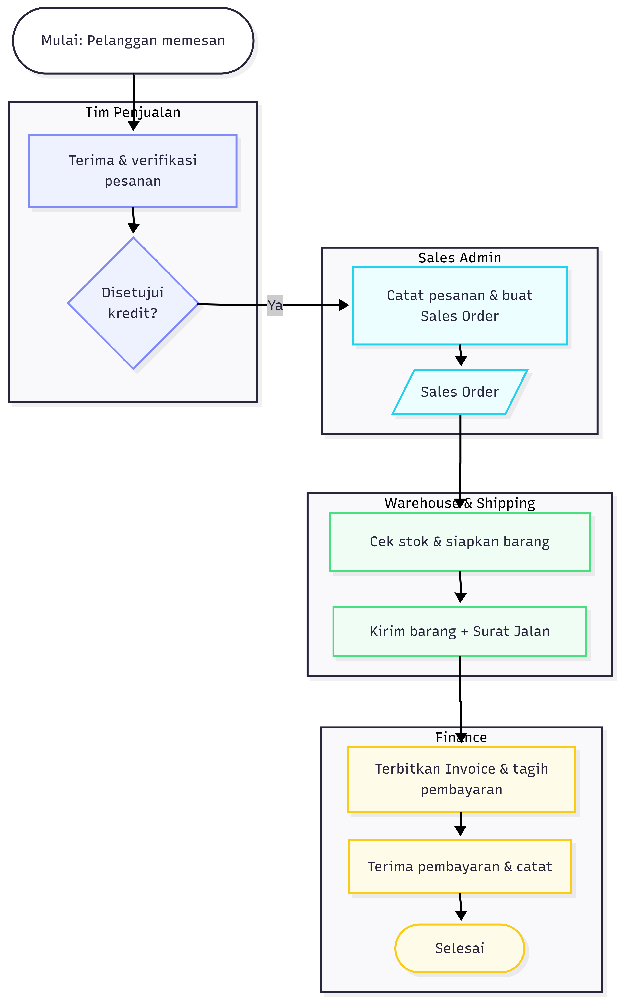
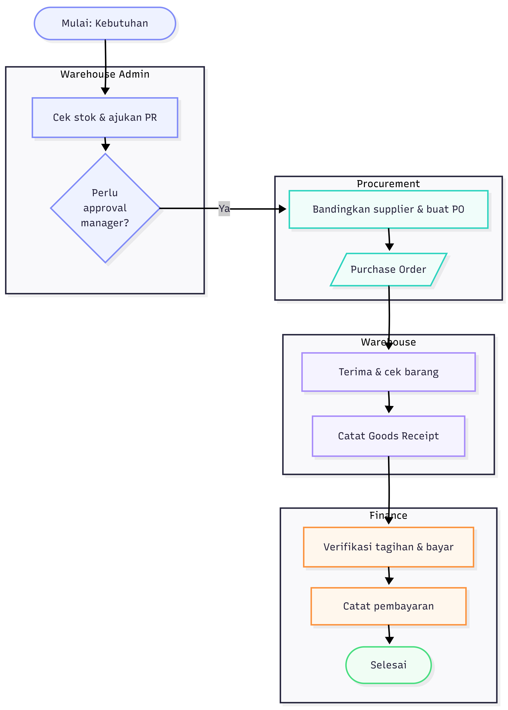

# PT Cuan Ciak Cao — Accounting Information System (AIS) Design & SQL Analysis

A systems-analysis and database project for a fictional multi-region distribution company (PT Cuan Ciak Cao, operating across Java and Bali). The project models the company's **Revenue Cycle** and **Expenditure Cycle** end-to-end — from business process flow, to a normalized REA (Resources-Events-Agents) data model, to a working relational database, to analytical SQL queries answering real management questions.

This repo contains the diagrams and SQL layer of that work: process flowcharts, REA diagrams, the resulting table relationships, and 10 business-driven SQL queries.

## What this demonstrates

- **Business process analysis**: mapping the Order-to-Cash (Revenue Cycle) and Procure-to-Pay (Expenditure Cycle) processes, including internal control points such as credit approval and manager approval for purchase requisitions.
- **Data modeling**: translating those processes into REA diagrams, then into a normalized relational schema with proper cardinality (1:1, 1:N, M:N) and segregation of duties reflected in the entity relationships (e.g. separate roles for who creates vs. who approves a purchase order).
- **Database implementation**: a 20+ table relational database (Microsoft Access) with defined primary/foreign key relationships.
- **SQL for business reporting**: 10 queries covering sales performance, receivables aging, inventory monitoring, supplier evaluation, and shipment discrepancy checks — the kind of analysis an AIS or finance team would actually run.

## Process Flows

| Revenue Cycle | Expenditure Cycle |
|---|---|
|  |  |

Each flowchart is organized by swimlane (department/role) — Sales Team, Sales Admin, Warehouse & Shipping, Finance on the revenue side; Warehouse Admin, Procurement, Warehouse, Finance on the expenditure side — showing handoffs and approval checkpoints.

## REA Diagrams

| Revenue Cycle | Expenditure Cycle |
|---|---|
|  |  |

The REA models capture the core Resources (Product, Inventory), Events (Sales Order, Delivery, Sales Invoice, Cash Receipt / Purchase Requisition, Purchase Order, Goods Receipt, Supplier Invoice, Cash Disbursement), and Agents (Customer, Supplier, Employee) for each cycle, with the responsible role noted on each event relationship for internal control traceability.

## Database Schema

The full schema (built in Microsoft Access) implements the REA models above as related tables — customers, suppliers, employees, regional data, orders, deliveries, invoices, receipts/disbursements, inventory, and their respective detail/line-item tables.

## SQL Queries

All queries in [`/queries`](./queries) run against the schema above and answer specific business questions:

| # | Query | Business Question |
|---|---|---|
| 01 | [Top 5 Best Seller Product](queries/top5_best_seller_product.sql) | Which 5 products sell the most by quantity and revenue? |
| 02 | [Penjualan per Produk](queries/penjualan_per_produk.sql) | Total quantity sold and revenue per product |
| 03 | [Penjualan per Customer](queries/penjualan_per_customer.sql) | Total revenue per customer, ranked |
| 04 | [Piutang Customer](queries/piutang_customer.sql) | Outstanding accounts receivable balance per customer |
| 05 | [Aging Piutang Customer](queries/aging_piutang_customer.sql) | Age of unpaid invoices past due date (receivables aging) |
| 06 | [Pembelian per Supplier](queries/pembelian_per_supplier.sql) | Total purchase value per supplier |
| 07 | [Evaluasi Supplier](queries/evaluasi_supplier.sql) | Supplier evaluation by transaction frequency and purchase value |
| 08 | [Laporan Persediaan](queries/laporan_persediaan.sql) | Inventory report by region and product |
| 09 | [Persediaan Minimum](queries/persediaan_minimum.sql) | Products at or below minimum stock level, by region |
| 10 | [Selisih Pengiriman](queries/selisih_pengiriman.sql) | Discrepancies between quantity ordered and quantity delivered |

**Techniques used**: multi-table `INNER JOIN` / `LEFT JOIN`, aggregate functions (`SUM`, `COUNT`), `GROUP BY` / `HAVING`, subqueries (`NOT IN`), date arithmetic for aging analysis, and MS Access–specific functions (`Nz`, `Date()`, `TOP N`).

## Tech Stack

- **Database**: Microsoft Access (SQL, relational schema design)
- **Diagramming**: Mermaid (flowcharts), REA modeling notation
